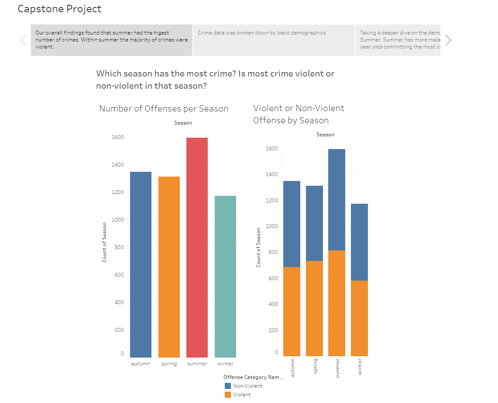
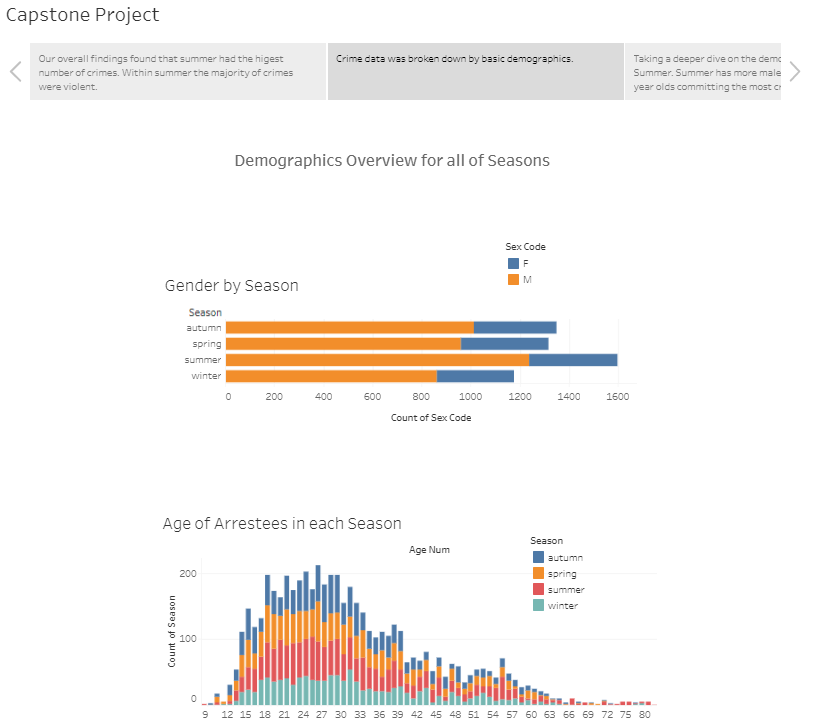
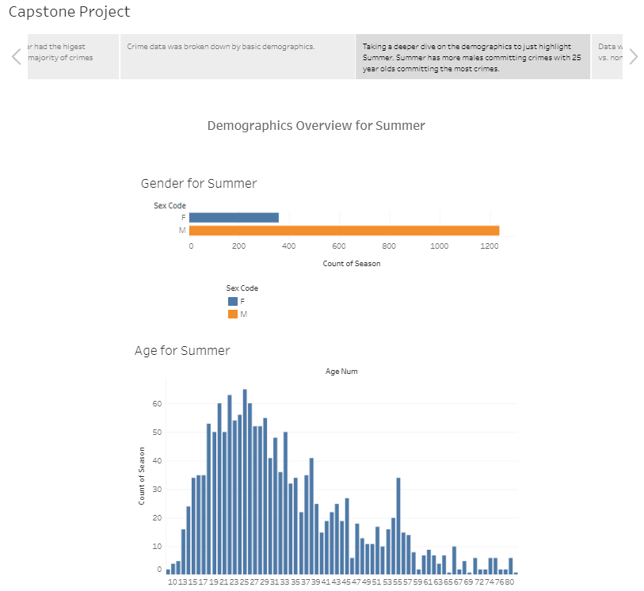
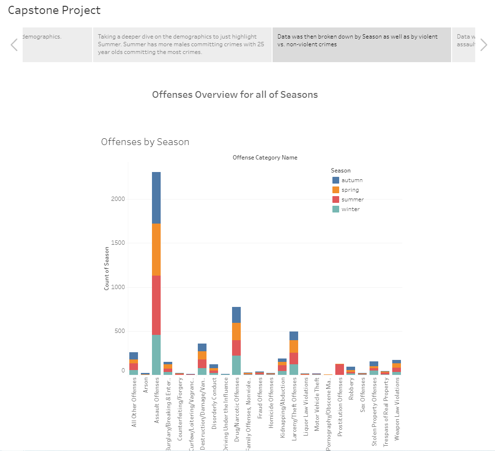
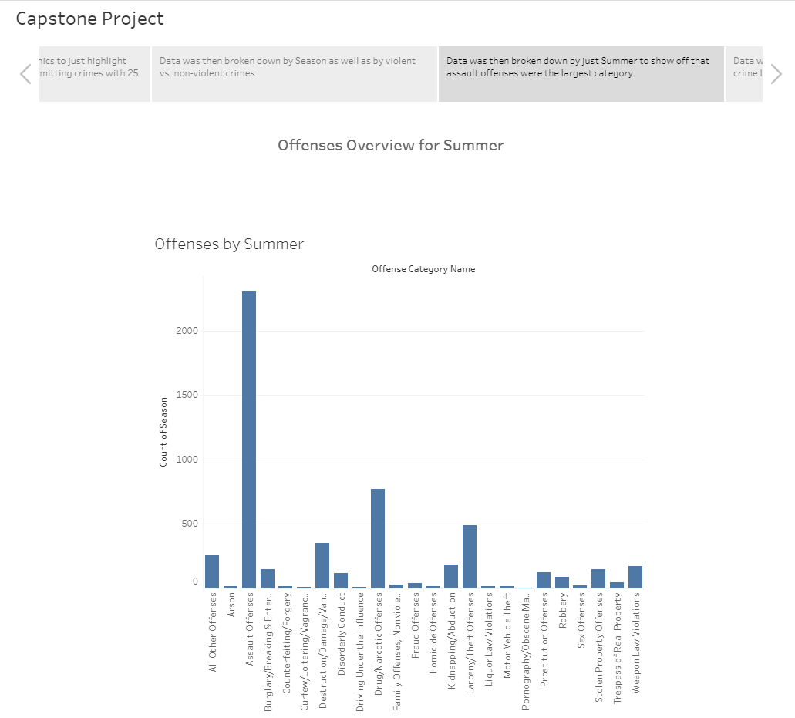
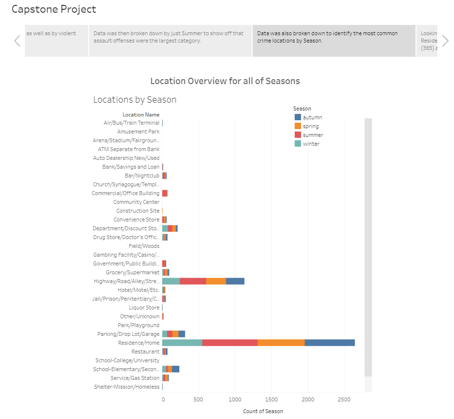
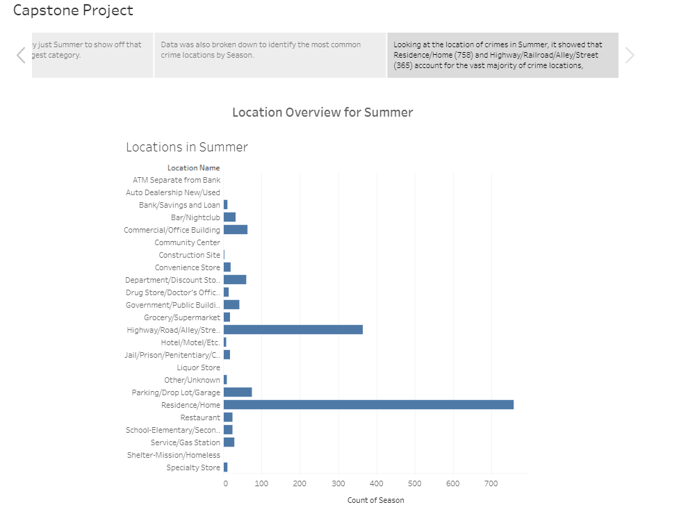

# Final Project

## Presentation
### Selected topic and rationale:
Our team bonded over our fascination with true crime. We started chatting about the Gabby Petito case that was ongoing over the course of this project. We also mentioned how we had seen what appeared to be an increase in headlines on crime in Chicago. Based on these two discussions we thought it would be interesting to see what is going on with crime in Illinois.  

### Description of the source of the data:
The data was garnered from the Federal Bureau of Investigation Crime Data Explorere (CDE). The CDE provides select datasets for download. Incident-based data by state, summary data estimates, and data about other specific topics may be downloaded in CSV files from the selections below. Data are also available via the Crime Data API, a read-only web service that returns JSON or CSV data, and provides experienced users access to large amounts of UCR data to use and share. 2019 Illinois crime data provided us with more than 6K crime records amassing over 150K data components. At first glance, we see that Illinois rate of violent crime offenses by population were increasing and much higher than the general U.S. population.

### Questions hope to anwser with the data:
1. In which season do the most crimes happen in IL?
2. In the season with the most crimes, are they more violent or nonviolent offenses?

### Description of the data exploration of the project:
- Ade to do. Rubric says the following must have been done - might be nice to hit on those parts:
✓ Database stores static data for use during the project ✓ Database interfaces with the project in some format (e.g., scraping updates the
database, or database connects to the model) ✓ Includes at least two tables (or collections, if using MongoDB) ✓ Includes at least one join using the database language (not including any joins in
Pandas) ✓ Includes at least one connection string (using SQLAlchemy or PyMongo)

## Machine Learning

### Random Forest

A random forest is an ensemble-based machine learning algorithm that is used to solve regression and classification problems. It is made up of many individual decision trees whose features are randomly selected and takes the average of the output from various individual trees in order to make a prediction. Advantages of using a random forest allow for easy interpretability, and are robust against overfitting and to outlier data. Limitations include biases while dealing with categorical variables and longer training periods.

We chose this model because random forests can run efficiently on large datasets, can handle thousands of input variables without deletion, and can be used to rank the importance of input variables. Given that our original dataset consisted of 5436 rows and 33 columns with a majority of categorical variables, it was necessary that we utilized a model that has the ability to classify large datasets with accuracy.

### Data Preprocessing 

#### Data Wrangling

- Formatted DataFrame using pandas.
- Created a dictionary for the seasons of the year and replaced season names with their corresponding integers to be used as the target variable for the model.
- Generated a list of categorical variables. 

#### OneHotEncoder

- Since machine learning algorithms do not work with categorical data directly, we must map all categorical data to integer values. We used scikit-learn's `OneHotEncoder` module to encode textual data into numerical data. First, we created a `OneHotEncoder` instance. Next, we used scikit-learn's `fit_transform()` method to train the list of categorical variables in order to convert the categorical data into numerical data in a pandas DataFrame. Then, we added the encoded variable names to the DataFrame. Lastly, we merged the encoded features and dropped the originals.

#### Feature Engineering 

- Removed null values and unnecessary columns related to the season and unique identifiers (ARRESTEE_ID, INCIDENT_ID, ARRESTEE_SEQ_NUM, ARREST_NUM, CLEARANCE_IND,FF_LINE_NUMBER, ARREST_TYPE_ID, OFFENSE_ID NUMBER, INCIDENT_ID NUMBER, LOCATION_ID, LOCATION_CODE) from the DataFrame.

#### Feature Selection
- Based on the dataset, the attributes chosen for feature selection include variables pertaning to demographics, offense, location, and arrest information to build a model to predict the season in which the most crimes take place in IL.  

    **Features**
    - ARREST_DATE: The date of the arrest. 
    - ARREST_TYPE_ID: How the offender was arrested. 
    - MULTIPLE_INDICATOR: (C = The arrestee was involved in more than one incident and should be counted for this incident; M = The arrestee was involved in more than one incident, is an duplicate arrestee, and should not be counted; N = Not applicable.)
    - OFFENSE_TYPE_ID: The offense type for which the arrestee was apprehended. This does not have to match any of the offense types in the incident.  
    - AGE_NUM: The age in years of an individual arrestee. 
    - SEX_CODE: The sex (gender) of an individual arrestee. (M = Male; F = Female; U = Unknown.)
    - RACE_ID: The race of an individual arrestee. 
    - ETHNICITY_ID: The ethnicity of an individual arrestee. 
    - RESIDENT_CODE: The arrestee was a resident in the reporting agency's jurisdiction. (R = Resident; N = Nonresident; U = Unknown.) 
    - ARREST_TYPE_NAME: Arrest type description.
    ATTEMPT_COMPLETE_FLAG: Whether the offense was attempted or completed. (A = Attempted; C = Completed) 
    - NUM_PREMISES_ENTERED: Total number of structures (premises) entered when offense is Burglary and location type is Hotel or Storage Facility. 
    - METHOD_ENTRY_CODE: Method of entry of a structure when offense is Burglary. (F = Force; N = No Force.) 
    - OFFENSE_NAME: NIBRS Offense name. 
    - CRIME_AGAINST: The type of entity this is a crime against (Person, Property, Society, Not a Crime - but tracked). 
    - CT_FLAG: This offense can be the primary offense in a Cargo Theft (Y/N). 
    - HC_FLAG: This offense can be the primary offense in a Hate Crime (Y/N). 
    - HC_CODE: The corresponding Hate Crime offense code from the Hate Crime tech spec. 
    - OFFENSE_CATEGORY_NAME: The NIBRS category for this offense. 
    - OFFENSE_GROUP: Offense Group (A/B). 
    - LOCATION_NAME: Location name from the tech spec. 

    **Target**
    - SEASON  

#### Split into training and testing sets

- The data was split into random train and test subsets using scikit-learn's `model_selection` package and its  `train_test_split()` function.

#### StandardScaler

- We used scikit-learn's `StandardScaler` module to reduce the liklihood that large values will influence the model. First, we imported the StandardScaler module and created an instance of it as `scaler`. Next, we trained the scaler and transformed the data using StandardScaler's `fit()` and `transform()` methods to standardize the data in each column.

### Random Forest Model

#### `RandomForestClassifier()`

- We created a random forest instance using the random forest classifier, `RandomForestClassifier`. The paramaters used in this model were `n_estimators` and `random_state`. In this model, we created 128 random forests. 
  
#### Fit the Model

- We fit the random forest model to our `X_train_scaled` and `y_train` training datasets. 
  
#### Make Predictions Using the Testing Data

- After fitting the model, we made predicitions using the scaled testing data. 

#### Evaluate the model

- We analayzed how well our random forest model classifies seasons by using the calcuating the confusion_matrix andaccuracy score. Lastly, we printed our confusion_matrix results along with the classification report for the four classes in our model (Winter, Spring, Summer, Autumn).
- Calculated feature importance and sorted them by their importance.

### Analysis

Based on the confusion matrix results, we found that our model ran successfully with an accuracy score of 0.9749816041206769. Therefore, our model accurately predicts the season for when a crime is commited in IL 97% of the time. In addition, the precision, recall, and f1 score for predicting the season align with the accuracy score.

### Description of the visualization phase of the project:
Utilized Tableau to visualize the data for this project. Tableau created various graphs to highlight the data for each season and also let us look more closely into the Summer timeframe. Images and link to the full Tableau story board are below.

Tableau worksheet: [https://public.tableau.com/app/profile/morgan.melnick/viz/CapstoneProject_16323549008720/CapstoneProject?publish=yes](url)

Google Slides: [https://docs.google.com/presentation/d/1rkWUOL07KlC43fTYwNyxtomenueDqG3A6acr1GFxLjw/edit#slide=id.gf126da89b8_0_177](url)

